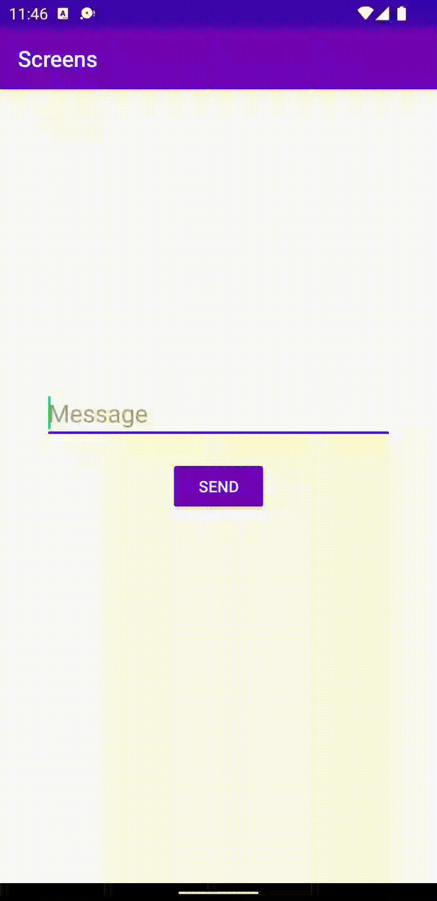

# Report

This assignment is all about activities and how to pass data between them, using [Intents](https://developer.android.com/reference/android/content/Intent). The idea is to launch another activity (often based upon user interaction), so that a new window is rendered onto the screen. This new window has its own layout, which in turn interacts with its own logic.

## Example

#### MainActivity

```java
Intent intent = new Intent(this, SecondActivity.class);
startActivity(intent);
```

Note that data can be bound to an intent, so that the same data is accessible within the new activity. This data is bundled as a key/value pair and can be accessed by reference to the unique key - in this case `message`.

#### MainActivity

```java
intent.putExtra("message", input.getText().toString());
```

#### SecondActivity

```java
final String message = getIntent().getStringExtra("message");
```

<p align="center">
  
</p>
